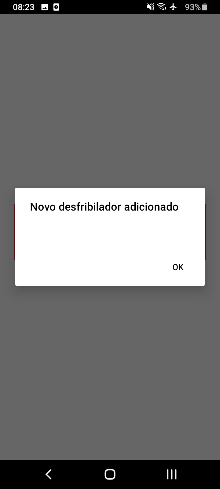
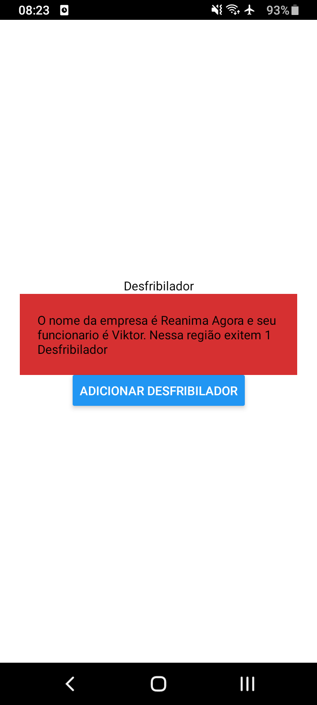
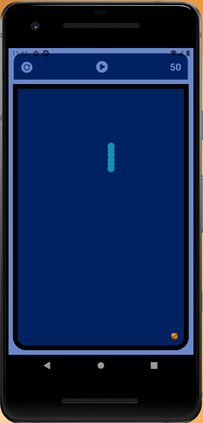
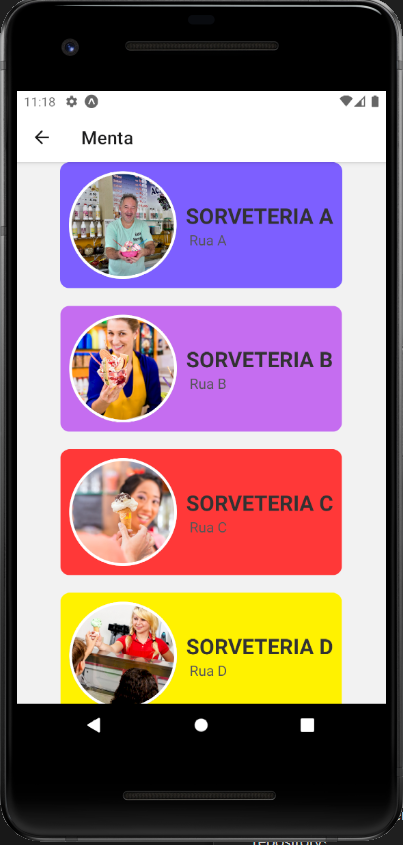

# Projetos em React Native

<h2>Projeto Construido aprendendo React Native 📱</h2>

<h3><b>EXPLICAÇÃO:</b> O projeto foi criado com a intenção que cada vez você clicar em "Adicionar desfribilador" o número ser adicionado 🌞 </h3>

   
   

<h3><b>EXPLICAÇÃO:</b> Foi criado o jogo da velha e o jogo da cobrinha🎮 </h3>

   
   
   

<h3><b>EXPLICAÇÃO:</b> Foi criado uma loja (Sorveteria) 🍦 </h3>

   
   
   

<h2>💻Tools</h2>

- REACT NATIVE 

- GIT 

- GITHUB 

<h2>📱Contact</h2>

viktorariel777@gmail.com

